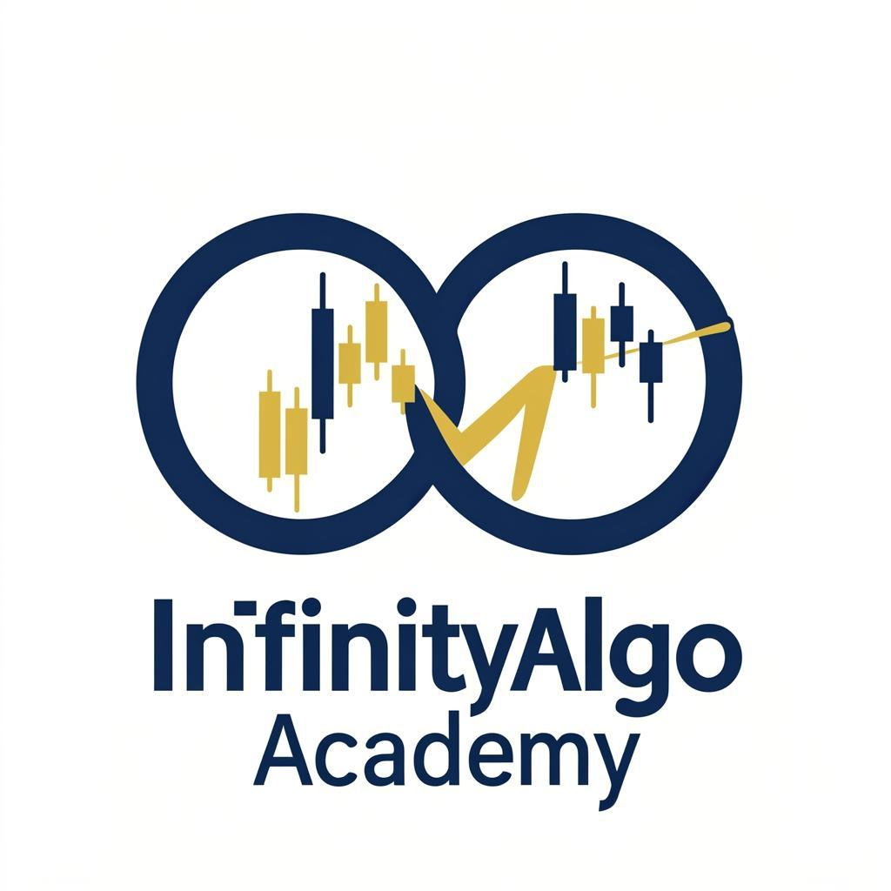

# 🏆 InfinityAlgo Academy

**Institutional-Grade Trading Intelligence for Gold Traders Worldwide**

A premium multi-page SaaS trading web application that provides institutional-grade analysis and sells trading indicators. Built with modern technologies for optimal performance and user experience.



---

## 📋 Table of Contents

- [Platform Vision](#platform-vision)
- [Features](#features)
- [Installation](#installation)
- [TradingView Connection](#tradingview-connection)
- [Gold Analysis Engine](#gold-analysis-engine)
- [Store Integration](#store-integration)
- [Order Bump Logic](#order-bump-logic)
- [Technology Stack](#technology-stack)
- [Project Structure](#project-structure)
- [Roadmap](#roadmap)
- [License](#license)

---

## 🎯 Platform Vision

InfinityAlgo Academy was designed to bridge the gap between retail traders and institutional-grade trading tools. Our mission is to provide everyday traders with the same analytical capabilities used by professional trading desks at major financial institutions.

### Core Philosophy

1. **Trade Where Institutions Trade** - Instead of chasing price action or reacting to market noise, identify the footprints left by institutional money and position alongside the smart money.

2. **Confluence-Based Trading** - Never rely on a single indicator or signal. Our system requires multiple confirmations before generating any trade recommendation.

3. **Transparency First** - Every signal comes with a detailed explanation of why it was generated, the confluence factors involved, and clear risk management guidelines.

4. **Education-Driven** - We don't just provide signals; we teach traders how to understand market structure, institutional behavior, and proper risk management.

---

## ✨ Features

### 🏠 Multi-Page Platform

- **Home** - Hero section with animated background, live signal preview, and trust statistics
- **Documentation** - Comprehensive 2,000+ word persuasive documentation covering all aspects
- **Pricing** - Three-tier pricing with feature comparison
- **Checkout** - High-conversion checkout with countdown urgency, order bump, and testimonials
- **Testimonials** - Grid of trader success stories with ratings and results
- **Contact** - Contact form and social links
- **Dashboard** - Live gold analysis with TradingView integration

### 📊 Trading Dashboard Features

- **Live TradingView Chart** - Real-time XAUUSD chart with full widget functionality
- **Multi-Timeframe Analysis** - 1m, 5m, 15m, 1H, 4H, Daily timeframe selector
- **Signal Output Panel** - Direction, entry zone, stop loss, multiple take profits
- **Confidence Gauge** - Visual confidence meter for each signal
- **Risk Calculator** - Built-in position sizing calculator
- **AI Trade Assistant** - Ask questions about current market conditions
- **Smart Alerts Panel** - Real-time alerts for market events
- **Backtest Preview** - Recent performance statistics

### 🧠 Analysis Engine

Our proprietary analysis engine continuously monitors and detects:

- **Market Structure** - Break of Structure (BOS), Change of Character (ChoCH)
- **RSI Divergence** - Regular and hidden divergence patterns
- **Supply & Demand Zones** - Key institutional price levels
- **Liquidity Sweeps** - Where stop losses are being targeted
- **Trend Strength** - Momentum analysis across timeframes
- **Volatility Filter** - Market condition assessment
- **Fake Breakout Detection** - Avoid trapped positions
- **Smart Volatility Filter** - High-news event filtering
- **Probability Scoring** - Confidence calculation for each setup

### 🌐 Internationalization

- **English (LTR)** - Full English language support
- **Arabic (RTL)** - Complete right-to-left Arabic translation
- One-click language switching in navigation

---

## 🚀 Installation

### Prerequisites

- Node.js 18+
- Bun package manager

### Quick Start

```bash
# Clone the repository
git clone https://github.com/yourusername/infinityalgo-academy.git

# Navigate to project directory
cd infinityalgo-academy

# Install dependencies
bun install

# Start development server
bun run dev
```

The application will be available at `http://localhost:3000`

### Production Build

```bash
# Build for production
bun run build

# Start production server
bun start
```

### Code Quality

```bash
# Run ESLint
bun run lint
```

---

## 📈 TradingView Connection

### Widget Integration

The dashboard integrates TradingView's official widget for real-time gold chart display:

```javascript
// TradingView Widget Configuration
new TradingView.widget({
  autosize: true,
  symbol: "OANDA:XAUUSD",
  interval: "15",
  timezone: "Etc/UTC",
  theme: "light",
  style: "1",
  locale: "en",
  toolbar_bg: "#f1f3f5",
  enable_publishing: false,
  allow_symbol_change: false,
  container_id: "tradingview-widget",
  hide_side_toolbar: false,
  studies: ["RSI@tv-basicstudies", "MASimple@tv-basicstudies"]
});
```

### Supported Features

- Real-time price updates
- Multiple timeframe switching
- Technical indicators overlay
- Drawing tools
- Full-screen mode
- Cross-platform compatibility

### Symbol Information

| Field | Value |
|-------|-------|
| Symbol | OANDA:XAUUSD |
| Description | Gold/US Dollar |
| Exchange | OANDA |
| Precision | 2 decimal places |

---

## 🤖 Gold Analysis Engine

### Architecture

The analysis engine operates through a sophisticated multi-layer system:

```
┌─────────────────────────────────────────────────────────────┐
│                    PRICE DATA INPUT                          │
│                  (Real-time from TradingView)                │
└─────────────────────────────────────────────────────────────┘
                              │
                              ▼
┌─────────────────────────────────────────────────────────────┐
│                   LAYER 1: Market Structure                  │
│     HH, HL, LH, LL Detection • BOS • ChoCH • Trend ID       │
└─────────────────────────────────────────────────────────────┘
                              │
                              ▼
┌─────────────────────────────────────────────────────────────┐
│              LAYER 2: Institutional Zone Detection           │
│       Order Blocks • FVG • Liquidity Pools • S/R Levels     │
└─────────────────────────────────────────────────────────────┘
                              │
                              ▼
┌─────────────────────────────────────────────────────────────┐
│              LAYER 3: Momentum & Divergence                  │
│        RSI Analysis • Regular/Hidden Divergence • MOM       │
└─────────────────────────────────────────────────────────────┘
                              │
                              ▼
┌─────────────────────────────────────────────────────────────┐
│              LAYER 4: Confluence Verification                │
│     Minimum 3 Confirmations Required → Signal Generation    │
└─────────────────────────────────────────────────────────────┘
```

### Confluence Rule

**CRITICAL**: The system will NEVER generate a signal without at least 3 confirming factors:

1. Market structure alignment
2. Institutional zone proximity
3. RSI divergence detection
4. Liquidity sweep confirmation
5. Trend strength validation
6. Volatility filter passage

### Signal Output Format

```typescript
interface Signal {
  id: string;                    // Unique signal identifier
  direction: "buy" | "sell";     // Trade direction
  entry: number;                 // Entry price
  stopLoss: number;              // Stop loss price
  takeProfits: number[];         // Multiple TP levels [TP1, TP2, TP3]
  confidence: number;            // Confidence percentage (0-100)
  risk: number;                  // Recommended risk percentage
  positionSize?: number;         // Calculated position size in lots
  reasons: string[];             // Array of confluence reasons
  institutionalZones: Zone[];    // Relevant institutional zones
  timestamp: Date;               // Signal generation time
  confluence: number;            // Number of confirming factors
}
```

### Risk Management Framework

| Account Size | Risk % | Stop Loss (pips) | Position Size |
|--------------|--------|------------------|---------------|
| $1,000       | 1%     | 10               | 0.01 lots     |
| $5,000       | 1%     | 10               | 0.05 lots     |
| $10,000      | 1%     | 10               | 0.10 lots     |
| $25,000      | 1%     | 10               | 0.25 lots     |

---

## 🛒 Store Integration

### Product Links

| Product | URL |
|---------|-----|
| Free Indicator | `https://infinityalgoacademy.net/item/honoalgo-tradingview-pinescript-free-download/` |
| Pro Checkout | `https://infinityalgoacademy.net/checkout/?fct_cart_hash=9b96cc6397bc86b43dce91f64ff5f74a` |
| Bundle Checkout | `https://infinityalgoacademy.net/checkout/?fct_cart_hash=08fbcfde8f713bcad6034350ec5dd865` |

### Integration Points

1. **Navigation CTA** - Primary "Get Started" button links to free product
2. **Pricing Cards** - Each plan links to appropriate checkout URL
3. **Checkout Section** - Dynamic URL based on order bump selection
4. **Documentation CTAs** - Embedded links throughout documentation

---

## 💰 Order Bump Logic

### Offer Details

| Field | Value |
|-------|-------|
| Product | InfinityRSI Divergence V6.2 |
| Original Price | $50 |
| Sale Price | $12.50 |
| Discount | 75% OFF |
| Availability | Limited Time |

### Implementation

The order bump is a toggle that modifies the checkout URL:

```javascript
const checkoutUrl = orderBump
  ? "https://infinityalgoacademy.net/checkout/?fct_cart_hash=08fbcfde8f713bcad6034350ec5dd865"
  : "https://infinityalgoacademy.net/checkout/?fct_cart_hash=9b96cc6397bc86b43dce91f64ff5f74a";
```

### Features Added with Order Bump

- Regular & Hidden Divergence Detection
- Multi-Timeframe Divergence Alerts
- Visual Divergence Lines on Chart
- Automatic TP/SL Suggestions
- Works on Any Timeframe
- Full Priority Support

---

## 🛠️ Technology Stack

| Category | Technology |
|----------|------------|
| Framework | Next.js 15 (App Router) |
| Language | TypeScript |
| Styling | Tailwind CSS |
| UI Components | shadcn/ui |
| Charts | TradingView Widget |
| Package Manager | Bun |
| Linting | ESLint |

---

## 📁 Project Structure

```
infinityalgo-academy/
├── public/
│   ├── logo.png              # Brand logo
│   └── robots.txt            # SEO configuration
├── src/
│   ├── app/
│   │   ├── globals.css       # Global styles & animations
│   │   ├── layout.tsx        # Root layout
│   │   └── page.tsx          # Main application (all sections)
│   ├── components/
│   │   └── ui/               # shadcn/ui components
│   ├── lib/
│   │   ├── analysis-engine.ts    # Signal generation logic
│   │   ├── translations.ts       # i18n translations
│   │   ├── db.ts                 # Database utilities
│   │   └── utils.ts              # Helper functions
│   └── hooks/                    # Custom React hooks
├── tailwind.config.ts        # Tailwind configuration
├── tsconfig.json             # TypeScript configuration
├── package.json              # Dependencies
└── README.md                 # This file
```

---

## 🗺️ Roadmap

### Phase 1: Core Platform ✅ (Current)
- [x] Multi-page single-page application
- [x] Arabic RTL + English LTR support
- [x] TradingView gold chart integration
- [x] Analysis engine with confluence rules
- [x] Store checkout integration
- [x] Order bump functionality

### Phase 2: Enhanced Analytics (Q2 2024)
- [ ] Real-time WebSocket price feeds
- [ ] Advanced backtesting system
- [ ] Performance analytics dashboard
- [ ] Custom indicator builder
- [ ] Trade journal integration

### Phase 3: AI Enhancement (Q3 2024)
- [ ] GPT-powered market commentary
- [ ] Predictive price modeling
- [ ] Sentiment analysis integration
- [ ] Automated strategy optimization

### Phase 4: Community Features (Q4 2024)
- [ ] Trader social network
- [ ] Signal sharing platform
- [ ] Leaderboard system
- [ ] Educational courses
- [ ] Live trading rooms

### Phase 5: Mobile App (2025)
- [ ] iOS native application
- [ ] Android native application
- [ ] Push notification system
- [ ] Offline signal caching

---

## 📞 Contact & Support

- **Email**: support@infinityalgoacademy.net
- **Support Hours**: Monday - Friday, 9AM - 6PM GMT
- **Average Response Time**: 2-4 hours

### Social Links

- Twitter: [@InfinityAlgo](https://twitter.com/infinityalgo)
- Telegram: [InfinityAlgo Community](https://t.me/infinityalgo)
- Discord: [Join Server](https://discord.gg/infinityalgo)
- YouTube: [InfinityAlgo Academy](https://youtube.com/@infinityalgo)

---

## ⚠️ Disclaimer

**Trading involves substantial risk of loss and is not suitable for all investors. Past performance is not indicative of future results. The high degree of leverage can work against you as well as for you.**

Before deciding to trade, you should carefully consider your investment objectives, level of experience, and risk appetite. The possibility exists that you could sustain a loss of some or all of your initial investment. You should not trade with money that you cannot afford to lose.

InfinityAlgo Academy provides educational tools and analysis for informational purposes only. We do not provide financial advice. Always conduct your own research and consult with a licensed financial advisor before making any investment decisions.

---

## 📄 License

© 2024 InfinityAlgo Academy. All rights reserved.

This software and its contents are proprietary and confidential. Unauthorized copying, distribution, or use is strictly prohibited.

---

Built with ❤️ by the InfinityAlgo Team. Empowering traders with institutional-grade tools.

**[Get Started Today →](https://infinityalgoacademy.net)**
